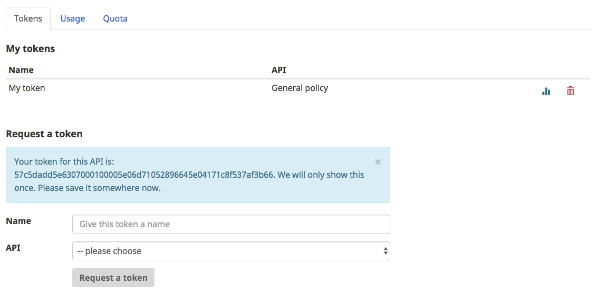
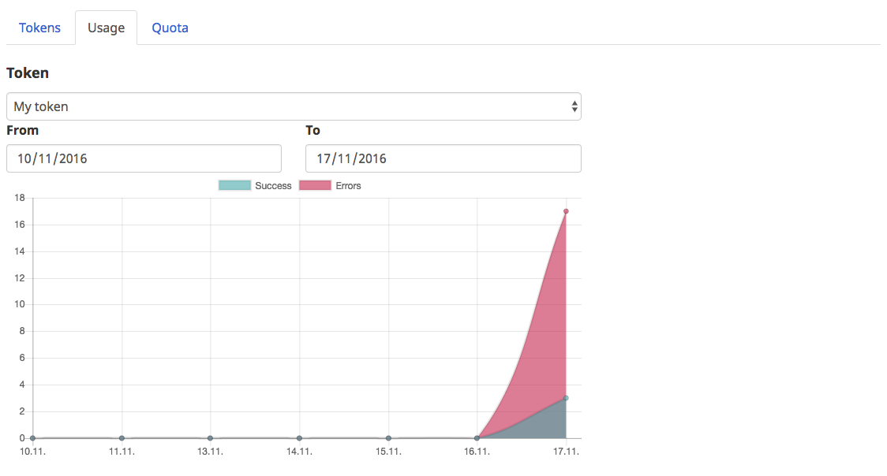
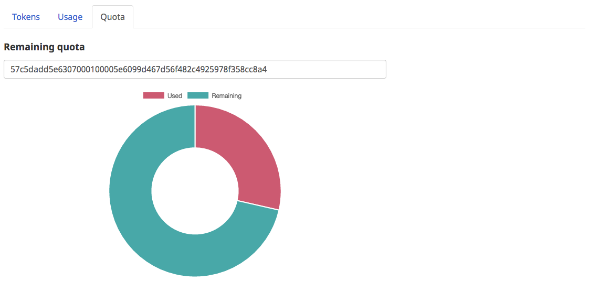

# Tyk Dev Portal

Contributors: teamamboss, chlab		
Tags: api, api-management, tyk, liip		
Requires at least: 4.6 		
Tested up to: 4.6.1	
Stable tag: 4.6.1	
License: MIT										
License URI: https://opensource.org/licenses/MIT

Integrates a developer portal of a Tyk API Gateway in your WordPress site

## Description

If you are using the [Tyk API Gateway](http://www.tyk.io) and have a WordPress site you can use this plugin to integrate a developer portal into your site. This is handy when your API requires a complementary website with information e.g. about the service and you want the developer portal in the same place. It's main goal is to offer developer sign up and obtaining access tokens from your WordPress site.

This plugin is a work in progress and currently offers the following features:

* automatic developer registration on Tyk when developers sign up in WordPress
* configuration of API policies available for token registration
* developers may request an access token for the available API policies
* automatic or manual approval of key requests
* storage of token (references) by name and API policy
* revoking of tokens by developer

What this plugin does not offer:

* Management of Tyk API Gateway (the Tyk Dashboard is best suited for that)
* WordPress user registration (there are enough plugins that do that quite well)

## Support

Please note that we, the plugin authors, cannot offer support for this plugin. The code is on [GitHub](https://github.com/liip/wp-tyk-dev-portal) however and we are happy to accept pull requests fixing bugs or adding functionality. Also feel free to report any [issues](https://github.com/liip/wp-tyk-dev-portal/issues) although we cannot promise when and if they will be fixed.

## Installation

* Upload the plugin zip file or install the plugin through the WordPress plugins screen directly
* Optional: choose and install a plugin that offers a better registration experience for WordPress users. This plugin was tested with [ProfilePress](https://wordpress.org/plugins/ppress/) and [Profile Builder](https://wordpress.org/plugins/profile-builder/), it should work with most or any registration/profile plugin though.
* Activate the plugins through the 'Plugins' screen in WordPress. Activation of this plugin should have triggered the creation of the user role "Developer" an the page "Developer Dashboard". Note that the "Developer Dashboard" page must have the slug "dev-dashboard" otherwise the scripts won't be included.
* Setup your Tyk Gateway in the Tyk Dashboard (assuming you already configured an API and policy):
	* Go to *System Management > Policies*
	* Tag policies that developers may register for with `allow_registration`
	* Name your policies accordingly, these will be shown to user for access token registration
	* Create a dedicated management user at *System Management > Users* (does not have to be an Admin), save, then generate an access
	token for this user on the same page (*Tyk Dashboard API Access Credentials*)
	* Go to *Portal Management > Settings* and make sure *Disable developer signup* is not active
	* Go to *Portal Management > Catalogue*, this is required because it does some setup work in the background, no need to do anything
* Add the following configuration to your wp-config.php file:

`
define( 'TYK_CONFIGURATION', 'cloud' );  // the tyk setup you're using ('cloud', 'on-premise' or 'hybrid')
define( 'TYK_API_ENDPOINT', 'https://admin.cloud.tyk.io/api/' );  // or the url to your Tyk installation
define( 'TYK_API_KEY', 'the access token' );  // access token you created for the management user
define( 'TYK_AUTO_APPROVE_KEY_REQUESTS', true );  // read more below
// these are only needed when TYK_CONFIGURATION is 'on-premise' or 'hybrid'
define( 'TYK_GATEWAY_URL', 'https://your.tykgateway.com/tyk' ); // the url of your tyk gateway
define( 'TYK_GATEWAY_SECRET', 'the gateway secret' ); // the gateway secret
// optional
define( 'TYK_FORCE_DISABLE_BOOTSTRAP', false );  // do not include bootstrap styles
`

## Screenshots

1. Developer Dashboard with token request in WordPress frontend
2. Usage graph per token and time period
3. Token usage quota (used / remaining requests)

## Changelog

### Version 1.1

* fixed language loading
* only allow 1 token per policy
* added support to force-disable bootstrap styles

### Version 1.0

* Initial release offering the features mentioned in the description

## Todos

The following changes are in planning:

* use catalogues on Tyk portal to group policies instead of tags
* make chart colors configurable
* split up template and dashboard.js into multiple components
* build js to vendor/ dir
* ~~refactor dashboard a bit considering that there can't be more than 1 token per API anyway~~
* ~~add option to not include bootstrap altogether~~
* ~~do not allow registering for multiple API policies (as it's not supported by Tyk)~~

## Further reading

### Automatic key approval

When `TYK_AUTO_APPROVE_KEY_REQUESTS` is set to `true` in wp-config.php, key requests will be approved automatically by this plugin. That means a developer will request an access token on the Dashboard page of your WordPress (where this plugin is running) and they will be processed automatically. For this to work, make sure *Require key approval* is not active in your Tyk Dashboard at *Portal Management > Settings*.

If you wish to approve key requests manually, set `TYK_AUTO_APPROVE_KEY_REQUESTS` to false and activate *Require key approval* mentioned above. When a developer requests an access token, he will get a message with his key request ID. The further process is up to you. Key requests can be approved in the Tyk Dashboard at *Portal Management > Key Requests*. You could configure an email to be sent out in the Portal Management Settings or do it manually.

### Custom dashboard page

The developer dashboard will be displayed in the same layout as your other pages. If you wish to further customize the page, you can create a [custom page template](https://developer.wordpress.org/themes/template-files-section/page-template-files/page-templates/) and embed the dashboard by using this template tag: `<?php tyk_dev_portal_dashboard()?>`.

### Styling

You may need to fix some styles as this plugin includes a subset of the [bootstrap](http://www.getbootstrap.com) styles with it and the styles of your theme may conflict with some of them. Bootstrap is only included when your theme doesn't already include it. You can set `TYK_FORCE_DISABLE_BOOTSTRAP` to `true` to force disable the bootstrap styles in case you need to.

### i18n

This plugin is ready for translation and currently supports the following languages:
* German
* French
* Italian